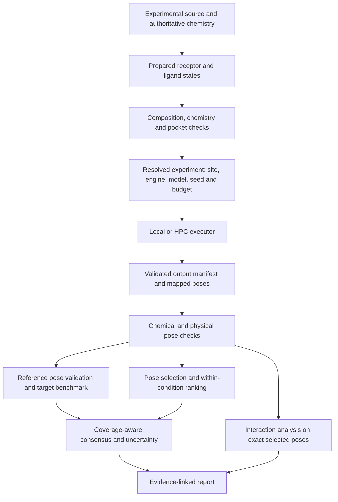

# A practical redesign for OmniDock

Proposal based on the scientific and engineering audit of commit `cfe33056c77d817d19439a9e9affe225d00ca488`. These are proposed requirements and sequencing, not implemented features or measured performance improvements.

## Product objective

Make OmniDock a dependable way to run, compare and interpret reproducible docking experiments. Each reported hit should link to the exact chemical state, receptor state, pose, scoring method, validation evidence and executed attempt that produced it.

Define a supported scientific domain explicitly. Start with noncovalent small-molecule docking for specified receptor/ligand classes and tested engine versions. Macrocycles, metals, retained cofactors, flexible receptors, covalent chemistry and unusual residues need tested capability profiles. “All-round” should mean coordinated, documented workflows across supported cases, with honest unsupported-case outcomes.

## Target workflow

Scientific computation and report rendering consume the same records. Reports should never recalculate a different “best” pose from raw scores. Optional figures should have no authority to change scientific success status.

## Five records that prevent many current bugs

| Record | Essential content | Invariant |
|---|---|---|
| `MolecularState` | Parent chemical identity, stereochemistry, protonation/tautomer state, formal charge, full molecular graph, source and prepared atom maps, coordinate provenance | Conversion cannot silently change chemistry. |
| `ReceptorState` | Structure/model/assembly/chains, altlocs, retained waters/metals/cofactors, missing/modelled regions, protonation treatment, frame and content hash | The receptor composition is explicit and auditable. |
| `ExperimentSpec` | Receptor/ligand state IDs, site/frame, requested/effective box, engine build, scoring model/parameters, seed, search budget, preparation protocol | Local and HPC execute the same scientific specification. |
| `PoseRecord` | Attempt ID, file/content hash, exact record index, graph/atom map, receptor frame and coordinates | Score, validation, interaction and export refer to the same pose. |
| `ScoreRecord` / `ValidationResult` | Metric identity, direction, units, model/condition scope; validation outcome, coverage, threshold and reason | No consumer guesses a sign, substitutes a missing value, or treats execution success as scientific validation. |

These records should be serializable and schema-versioned. Human-readable compound names and PDB codes are labels; stable IDs establish identity. Keep `requested` and `applied` preparation/settings separately whenever they differ.

## Stage 1 — Correct the calculations and establish regression oracles

Use small changes behind the current command surfaces. Make the audit counterexamples into independently specified tests before changing their implementations.

1. Centralize score metadata and ordering. Empirical docking energy is lower-is-better; CNN pK affinity and CNN pose score are higher-is-better, with distinct purposes. Fix normalization, spread treatment and atlas ordering. Test every supported score/selection combination.
2. Replace ligand-fitted redocking RMSD with symmetry-aware, chemically mapped heavy-atom RMSD in a common receptor frame. Receptor alignment is allowed only when needed, recorded, and applied to the ligand. Keep shape RMSD separately named.
3. Unify SDF/PDBQT/DLG pose indexing; reject out-of-range indices and malformed records. Validate the exact scored record. Do not truncate unmatched heavy atoms into agreement.
4. Enforce explicit experimental references and typed flags. Remove raw/generated-conformer fallback from native-pose validation. Keep attempted, evaluable and passed counts, independent reference count, and per-condition coverage.
5. Remove unsupported pocket-volume/druggability claims. Add finite-coordinate checks; required structural QC cannot pass on exceptions.
6. Remove raw cross-engine minima from scientific winner/reference decisions. Use compatible within-condition comparisons, preserving every original score.

**Acceptance gate:** translated poses fail docking RMSD; true symmetry permutations pass; arbitrary atom permutation without a valid map cannot pass; model 2 is actually model 2; stronger scores stay stronger through every export; 99 missing references remain visible and prevent an unjustified high-confidence label. An empty structure produces no pocket measurement. Compare the affected output tables before/after on a frozen copy of a real user campaign once the environment is available.

## Stage 2 — Make preparation an explicit chemical experiment

Create separate immutable artifacts for the original complex, experimental reference ligand and composed docking receptor. Select the source model/assembly/chains and full ligand instance identity. Preserve receptor-bound cofactors and biologically important waters according to a recorded target policy; remove the benchmark ligand explicitly for ordinary competitive docking/redocking.

For ligands, combine authoritative molecular chemistry with observed coordinates and a stable atom map. Do not treat an ideal CCD conformer as an experimental pose. Preserve charges, bond orders, stereochemistry and macrocycle ring closures through preparation and export. Define parent/state/conformer IDs so multiple prepared states do not become unrelated “compounds.”

For receptors, inventory missing atoms/residues, alternate conformations and nonstandard chemistry. Use strict preparation first; record any repair, deletion or fallback as a molecular difference. Restrict automated repair to supported, justified cases. Pocket mutations/deletions, metal coordination and uncertain histidine/ligand states need explicit checks. Default hydrogen addition does not establish a requested pH-dependent state.

Derive site boxes from the selected reference's heavy-atom envelope plus recorded padding, or a specified pocket method. Test containment in the correct coordinate frame. Preserve chain/residue/insertion-code identity in contact calculations. Add bounded receptor/ligand state alternatives when uncertainty is scientifically important.

**Acceptance gate:** selected benchmark ligand absent from intended receptor, required cofactor retained, no silent heavy-atom loss, consistent altloc conformer, finite coordinates, template/graph identity verified, macrocycle round trip intact, and a preparation ledger showing exact changes and backend versions. Unsupported chemistry must produce an explicit outcome.

## Stage 3 — Make each executed attempt reproducible

Resolve the full scientific specification once, then pass it to existing local/Slurm/HTCondor adapters. Separate transport/resources from chemical and search parameters. Generate AD4 parameter files from staged relative paths or on the destination host; share the parameter-set identity between AutoGrid and AutoDock. Record effective grid dimensions after discretization.

Use immutable attempt directories. Include explicit seeds and engine/model/container identity; exact reproducibility can still depend on hardware and numerical environment, so record those and distinguish identical protocol from bitwise identity. Write temporary outputs and publish them only after validation. Resume from a successful matching attempt manifest, never from filename existence. Parse accepted outputs via that manifest, preserving diagnostic logs separately.

Replace stat-only/incomplete cache dependencies with hashes of all scientific inputs and effective configuration. Make state updates transactional across threads/processes. Block descendants of failed/blocked prerequisites. Validate node output schemas before recording completion, and distinguish failed, invalid-output, skipped, and not-evaluable.

**Acceptance gate:** change a receptor, ligand, score model, reference pose, seed, box or relevant config and the correct artifacts invalidate. Normal cached and forced runs agree. Local/HPC scientific command/config content agrees, including after relocation. Failed/empty/truncated output never enters scientific tables, campaign exit status reflects failures, and simultaneous state writers both persist.

## Stage 4 — Rebuild post-docking analysis around evidence

Treat sampling, pose selection and compound prioritization as separate stages. Preserve all valid sampled poses and all score metrics. Compare Top1 selection with best-of-N reference recovery to distinguish search failures from scoring failures. Add validity checks for graph/stereochemistry preservation, internal geometry, severe receptor clashes and pocket placement. A narrowly defined rescue minimization can be evaluated as a separate protocol with before/after coordinates; it should not hide invalid input.

Compute interaction fingerprints from the exact mapped ligand SDF plus receptor state, retaining necessary cofactors and chain identity. Hydrogen-bond/charge/aromaticity assignments must use verified chemistry and a documented hydrogen policy. Measure contact occupancy across selected plausible poses/states as a sensitivity analysis. An interaction diagram is a description of a modeled geometry, not a measurement of binding strength.

For consensus, begin with transparent within-target, within-condition ranks and explicit engine/pose coverage. Record pairwise pose agreement separately from rank agreement and output availability. Evaluate correlation among related engines; do not count correlated wrappers as independent experimental support. Learn weights/calibration only if held-out data justify them. A visible vector of scores and validation checks may be more useful than one opaque hybrid score.

Replace global “Strong” or “selective” declarations with labels such as `high within-target rank`, `reference recovery passed`, `physical checks passed`, `insufficient benchmark coverage`, and `sensitive to receptor state`. Reserve potency/selectivity claims for calibrated endpoints. Polypharmacology should retain missing targets as missing and show target-specific evidence/coverage. Validate biology-table join cardinality and endpoints; docking scores cannot establish a cellular mechanism from correlation alone.

**Acceptance gate:** each report row links to its exact pose/chemistry/run; score direction and reference scope remain consistent; unavailable engines and targets remain in denominators; interaction failures cannot appear as zero-contact success; calibrated claims carry their validation set and uncertainty.

## Stage 5 — Benchmark before claiming improvement

Create a versioned evaluation dataset representative of the pipeline's intended targets and chemistry. An initial engineering corpus could contain roughly 20 curated reference complexes, expanded as support grows; that number is a project proposal, not a universal sufficient validation sample. Include ordinary druglike ligands, charged/aromatic ligands, symmetry, multiple poses, chains/altlocs and deliberately unsupported cases. Add metals/macrocycles only when claiming support.

Keep a target/chemical-series or otherwise justified held-out split, and audit overlap with training data for learned scoring models. Use the identical test split for the current corrected baseline and every proposed improvement. Do not optimize a protocol on the same complexes used to claim its performance. A cocrystal-derived box is appropriate for a known-site redocking experiment; it must be distinguished from blind docking or cross-docking evaluation.

| Question | Measure | Reporting requirement |
|---|---|---|
| Is preparation preserving the experiment? | Chemical identity, retained composition, atom mapping, state changes and valid-input rate | Reasons for all exclusions/repairs, by chemistry class |
| Does sampling recover a pose? | Best-of-N heavy-atom RMSD in receptor frame; physical-validity pass rate | Attempted/evaluable counts and sample budget |
| Does selection find it? | Top1/TopN pose-recovery rate under the declared policy | Multiple explicit seeds; per-target results and uncertainty |
| Does screening enrich actives? | EF at a prespecified cutoff, PR-AUC and a suitable early-recognition measure; ROC-AUC as a complement | Measured actives/inactives, prevalence and scaffold/target controls |
| Does ranking track an endpoint? | Within-target Spearman/Kendall against a comparable assay endpoint | Independent compounds, sufficient sample size and endpoint identity |
| Is the workflow dependable? | Invalid-output rate, restart correctness, protocol parity, cache equivalence | No silent-failure exclusions |
| Is the extra cost worthwhile? | Runtime/resource cost versus recovery/enrichment gain | Fixed datasets, comparable budgets and hardware |

Use confidence intervals with the resampling unit matched to the question, e.g. independent complexes or targets rather than thousands of correlated poses. Set thresholds before evaluation; select meaningful target-specific goals rather than promising a universal docking success percentage. Include all pipeline failures in coverage and report valid-only performance separately.

Physical validity checks are supported by the [PoseBusters study](https://pubs.rsc.org/en/content/articlehtml/2024/sc/d3sc04185a). [LIT-PCBA](https://pubmed.ncbi.nlm.nih.gov/32282202/) offers measured active/inactive screening sets designed to reduce common benchmark biases. [Vina documentation](https://autodock-vina.readthedocs.io/en/stable/faq.html) emphasizes target-dependent accuracy and separates sampling from scoring problems. These sources justify the evaluation dimensions, not guaranteed performance for OmniDock.

## Development structure and release practice

Use one installable package with narrow module interfaces for preparation, run compilation/execution, pose reading, validation, ranking and reporting. Retain the existing engine adapters. Keep command-line and interactive interfaces as clients of the same implementation. Avoid splitting into network services unless a measured deployment need requires it.

Introduce discoverable pytest tests, real versioned parser fixtures, a small real-engine integration job, clean-wheel installation checks and a supported-platform matrix. Optional integrations get extras and smoke checks; scientific correctness must not depend on a plotting executable. Pin scientific tool builds/model weights and record hashes in every run.

Track work in small changes with explicit acceptance tests. The first cycle should cover Stage 1 plus the stale-result and cache fixes from Stage 3, because trustworthy before/after scientific comparisons require trustworthy run attribution. Then establish preparation contracts, protocol parity and the benchmark. Advanced ensembles, new scoring models, larger screens and richer visuals become justified when the corrected baseline shows what improvement is actually needed.
