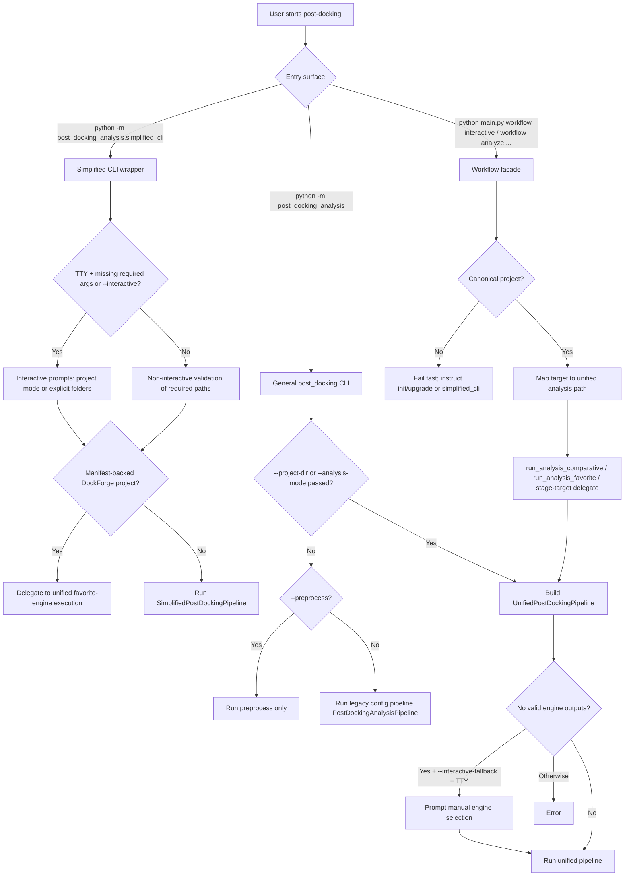
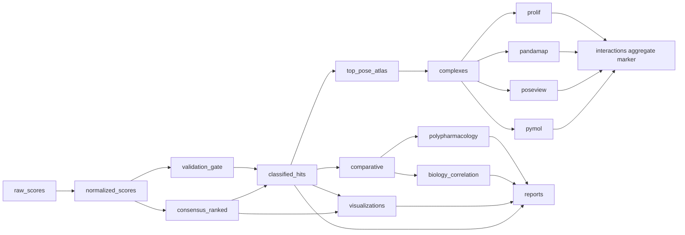

# Post-Docking Interactive + CLI Decision Tree

This document captures the current routing logic and execution decision points for post-docking analysis.

Code basis (inspected):
- `post_docking_analysis/cli.py`
- `post_docking_analysis/simplified_cli.py`
- `post_docking_analysis/unified_pipeline.py`
- `post_docking_analysis/engine_detector.py`
- `post_docking_analysis/multi_engine_pipeline_impl.py`
- `post_docking_analysis/simplified_pipeline_impl.py`
- `workflow/execution.py`
- `workflow/cli.py`
- `post_docking_analysis/consensus.py`
- `post_docking_analysis/top_pose_selector.py`
- `post_docking_analysis/redocking_validation.py`

## 1) Entry Decision Tree (Interactive vs CLI Surfaces)



## 2) Unified Engine/Mode Routing Decision Tree

```mermaid
flowchart TD
    U0[UnifiedPostDockingPipeline init] --> U1[detect_engines(project_dir)]
    U1 --> U2{routing_decision}

    U2 -->|single_engine| U3[route to one engine]
    U2 -->|multi_engine| U4[route to comparative]
    U2 -->|no_valid_engines| U5{explicit engine hint or interactive fallback?}

    U5 -->|explicit hint| U3
    U5 -->|interactive_fallback enabled| U6[defer selection to caller prompt]
    U5 -->|no| U7[raise ValueError]

    U3 --> U8[resolve engine scope: --engine / --engines / --engine-preset]
    U4 --> U8
    U8 --> U9{effective mode}
    U9 -->|one scoped engine| U10[single_engine]
    U9 -->|multiple scoped engines| U11[comparative_all_engines]
    U9 -->|favorite mode requested| U12[favorite_engine_continue]

    U10 --> U13[request artifact scope via DAG]
    U11 --> U13
    U12 --> U13
```

## 3) Artifact DAG Scope Tree (Canonical Unified Execution)

Scope mapping:
- `full`, `report_only`, `rescoring_only`, `qc_only` -> `reports`
- `comparison_only` -> `classified_hits`
- `structures_only` -> `complexes`
- `interactions` -> `interactions`
- `top_pose_only` -> `best_poses` (top-pose atlas output)



Notes:
- Interaction tool nodes are optional and non-blocking.
- `reports` intentionally does not block on all interaction node completion; it consumes whatever exists.

## 4) Scientific Appraisal of Major Decision Nodes

| Decision node | Scientific role | Strength | Limitation / risk |
|---|---|---|---|
| Engine detection + routing (`single`, `multi`, `no_valid`) | Prevents combining incomplete/absent engine outputs | Uses manifest/filesystem evidence and coverage status | Coverage threshold is heuristic; partial engines can still enter scope |
| Redocking validation gate | Anchors confidence to known/reference poses and RMSD reproducibility | Conservative: no fake validation when geometry missing | Requires reference structures and atom correspondence; can be `needs_review` with sparse references |
| Score normalization (`rank`, `minmax`, `zscore`) | Makes engine scales comparable before consensus | Multiple methods for robustness checks | Different methods can reorder borderline candidates |
| Consensus policy (`dockbox_geometric`, `weighted_hybrid`, `strict_consensus`, `favorite_guardrails`) | Integrates affinity + agreement into ranking | Explicit, auditable formulas and metadata | Mode choice encodes study philosophy; should be predeclared for reproducibility |
| Target-aware hit classification | Converts ranked hits into interpretable Strong/Moderate/Weak + QC | Keeps docking quality separate from ADMET flags | Percentile classes can drift when per-target sample size is small |
| Top-pose atlas policy (`best_affinity`, `best_consensus`, `hybrid`) | Produces deterministic per-ligand representative pose | Tie-breaks are deterministic and recorded | Single global representative can hide alternate mechanism-relevant poses |
| Optional interaction/visual blocks | Adds mechanistic interpretability (contacts, 2D/3D maps) | Non-blocking avoids full-run failure | Missing dependencies reduce interpretability, not core ranking validity |

## 5) Function of Each Framework Branch

1. `simplified_cli` local GNINA branch:
   Function: fast practical path for GNINA-like folder layouts; can prompt for missing paths and naming; executes the simplified stage pipeline directly.

2. `simplified_cli` manifest-backed delegation branch:
   Function: enforces canonical unified behavior when project metadata exists; avoids divergence between legacy and canonical outputs.

3. `post_docking_analysis/cli.py` unified branch:
   Function: full engine-aware analysis with analysis mode, engine scope, consensus, hit-class policy, and DAG artifact scope control.

4. `post_docking_analysis/cli.py` preprocess branch:
   Function: builds score/pair artifacts only; no full analytics.

5. Legacy config pipeline branch:
   Function: backward compatibility for older single-input workflows.

6. Workflow interactive/facade branch:
   Function: operator-guided orchestration that maps stage choices to unified execution while preserving reproducibility artifacts.

## 6) Operational Articulation (How They Work Together)

1. Input routing:
   Entry surface selects interactive prompting or pure CLI parsing, then resolves to either simplified pipeline or unified pipeline.

2. Engine/mode selection:
   Unified routing converts detection + user constraints into an effective analysis mode and scoped engines.

3. Core scoring layer:
   Raw/normalized score tables are built first, then validated (redocking gate), then ranked by consensus.

4. Interpretation layer:
   Classified hits, top-pose atlas, comparative/polypharmacology/biology summaries, and visualization suites are derived from consensus outputs.

5. Structural/interaction layer:
   Complex PDBs and interaction analyses (ProLIF/PandaMap/PoseView/PyMOL) consume top-pose/complex artifacts.

6. Consolidation layer:
   Reports + run tracking + manifests tie every stage together with deterministic outputs and audit metadata.

In short: interactive and CLI frameworks are front-end selectors over the same analytical backbone; canonical mode pushes everything through a scoped artifact DAG, while simplified mode offers a GNINA-centric direct execution path and now delegates to unified when canonical manifests are present.
